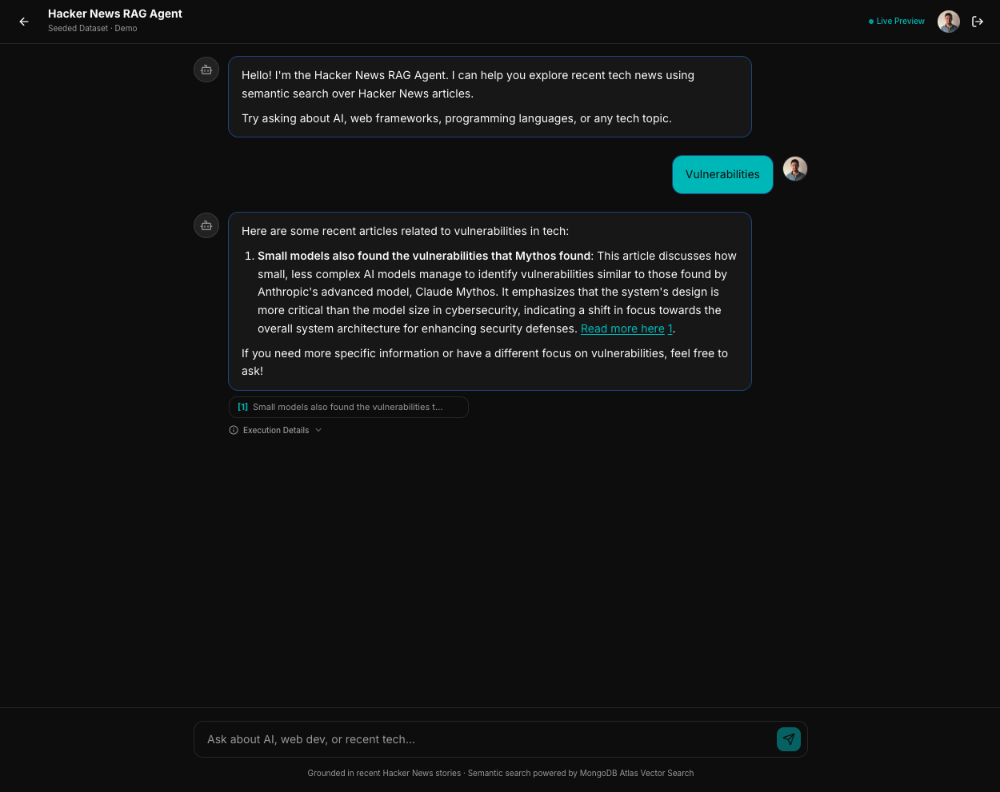

# gercastro.xyz — Portfolio & Public Work

Personal portfolio and project showcase for **Germán Castro**, Senior Fullstack Engineer with 11+ years of experience building SaaS products across Latin America. This monorepo hosts the site and doubles as a small reference for how I structure apps (Turborepo, strict Node pin, CI, and deployment automation).

**Custom domain (`gercastro.xyz`):** the portfolio and Next.js app are **served in production** on `https://gercastro.xyz` (CloudFront + ALB + ECS on EC2). App secrets (OpenAI, MongoDB, Google OAuth, NextAuth, etc.) are stored in **AWS Secrets Manager** as JSON and injected at runtime in the ECS task (see `infra/modules/ecs` and the Infrastructure section in [`apps/README.md`](./apps/README.md)).

**Repository:** [github.com/gercas77/portfolio](https://github.com/gercas77/portfolio)

For current status, phases, and architecture, see [`apps/README.md`](./apps/README.md).

---

## Preview: Hacker News RAG Agent

This repo ships the **Hacker News RAG Agent**: sign in with Google, ask questions in natural language, and get **streamed** answers grounded in retrieved stories with **citations** and optional **execution metadata** (tokens, tool use). The screenshot below is from local development; the same flows are available on the live site when configured with the production backend and data.

<p align="center">
  
</p>

<p align="center"><em>Route: <code>/hackernews/chat</code> · Deep dive: <a href="./apps/README.md"><code>apps/README.md</code></a></em></p>

---

## Repository layout

```
portfolio/
├── docs/readme/             ← README assets (e.g. hn-chat.png for preview above)
├── apps/
│   └── web/                 ← Next.js site (Dockerfile for ECS; see apps/README)
├── documentation/tasks/    ← Dated implementation plans (see .agents/skills/plan-feature)
├── .agents/
│   ├── skills/            ← Agent skills (planning, UI, API, workflow)
│   └── references/        ← Focused docs (e.g. architecture) to avoid loading all of apps/README
├── packages/                ← Reserved for shared packages later
├── .github/workflows/
│   ├── ci.yml              ← PR: lint + build
│   └── deploy.yml          ← main: Docker build, ECR, ECS deploy
├── AGENTS.md                ← Short repo map for agents (commands, paths, doc index)
├── turbo.json
├── pnpm-workspace.yaml
├── package.json
└── README.md
```

---


## Next steps

Aligned with the delivery plan in [`apps/README.md`](./apps/README.md) — **Phase 1.2** (Terraform + CI/CD + public URL) is in place; ongoing work is mostly product and later pipeline phases.

1. **Phase 2–3 (Hacker News RAG Agent)** — Live event-driven pipeline: RabbitMQ, Redis, ingestor / embedder / fetcher / summarizer containers; replace validation-only assumptions with continuous data (see apps README for the full checklist).
2. **Phase 4** — Production observability (e.g. Langfuse, tighter CloudWatch usage) on the live path.
3. **Portfolio polish** — Landing design (hero, typography, motion) and copy in `apps/web` (e.g. `src/lib/site.ts`) as positioning evolves.
4. **Contact modal** — Replace the public **`mailto:hello@gercastro.xyz`** affordance with an in-site form wired to a transactional provider when you want to avoid depending on a hosted mailbox.
5. **Agent workflows** — Skills under **`.agents/skills/`**; extra focused docs under **`.agents/references/`**. See **`AGENTS.md`** for commands, paths, and which doc to open when; feature plans under **`documentation/tasks/`**.

